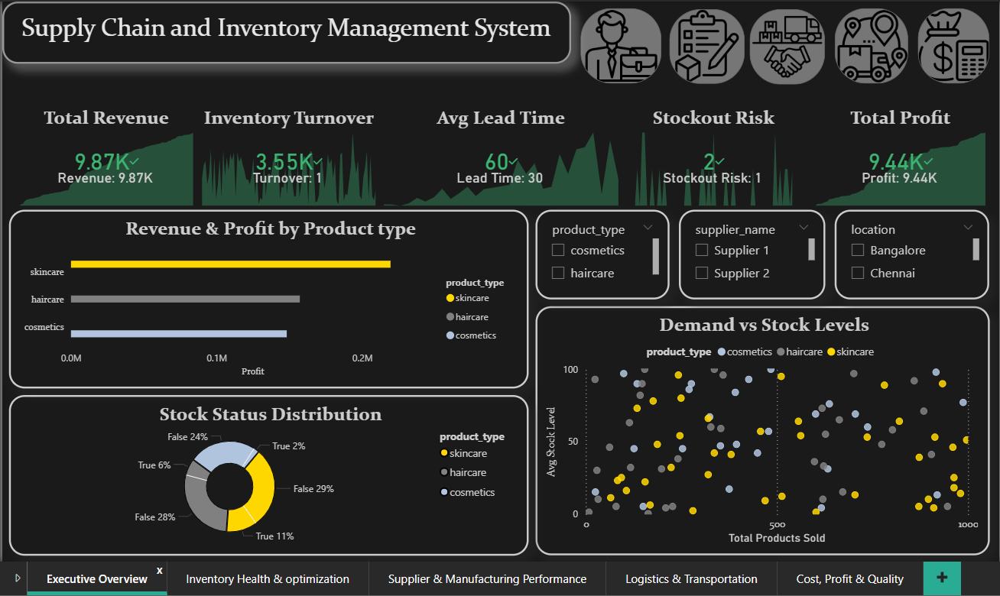
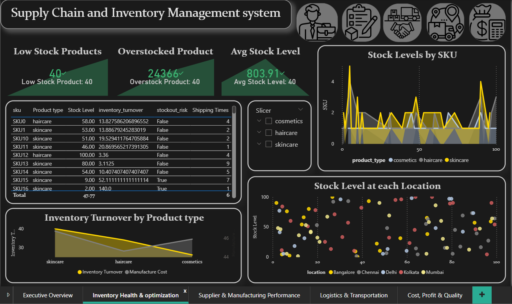
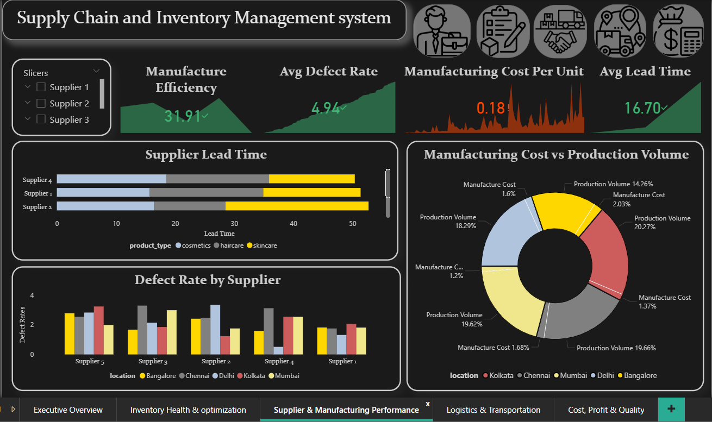
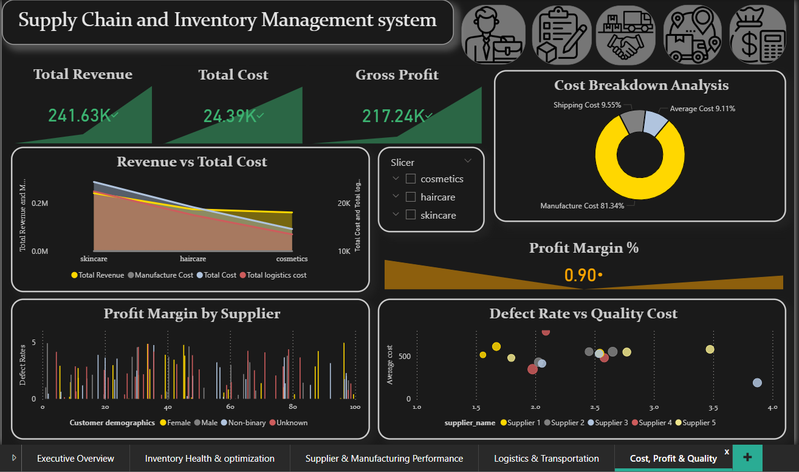

# 📦 Supply Chain, Inventory & Cost Analytics Dashboard

## 📌 Project Overview

This project focuses on end-to-end Supply Chain Analytics, covering inventory health, supplier performance, logistics efficiency, cost impact, and profitability analysis.
The goal is to convert raw operational data into actionable business insights using data analysis and Power BI dashboards.

The project simulates a real-world supply chain environment, where perfect data is not available and analytical assumptions are required.

---

## 🎯 Business Objectives

Monitor inventory efficiency and identify slow-moving SKUs

Evaluate supplier reliability and manufacturing performance

Analyze logistics cost, shipping time, and route efficiency

Understand how quality issues and defects impact cost and profit

Provide a decision-ready dashboard for business stakeholders

---

## 🧾 Dataset Description

The dataset contains 23 operational and financial columns, including:

Product & SKU information

Sales, revenue, and availability

Inventory levels and stock movement

Supplier and manufacturing details

Lead times and production volumes

Shipping, transportation, and logistics costs

Defect rates and inspection results

---

## 🛠️ Data Preprocessing & Feature Engineering

Checked and validated data types and null values

Removed non-essential identifiers to improve Power BI performance

Created derived metrics, including:

Inventory Turnover (proxy)

Derived Reorder Threshold

Cost per Unit

Quality Loss Cost

Profit Margin

Standardized column usage for efficient Power BI modeling

---

# 📊 Data Analysis

The initial analysis was performed using a Python Jupyter Notebook to deeply understand the dataset before building dashboards.

## 🔍 Exploratory Data Analysis (EDA)

Distribution analysis of:

Sales volume

Inventory levels

Lead times

Shipping times

Defect rates

Identified outliers and variability in logistics and manufacturing processes

Analyzed relationships between cost, time, and quality

## 📈 Key Analytical Insights

Products with low inventory turnover indicate overstocking risk

Higher lead times are strongly associated with stock availability issues

Certain suppliers show consistently higher defect rates

Logistics cost increases significantly with faster transportation modes

Manufacturing cost and defect rate together impact profitability

## 📊 Visualization (Plotly)

Interactive plots were created using Plotly for:

Inventory turnover trends

Supplier lead time comparison

Shipping cost vs shipping time

Defect rate impact on cost

These insights guided the final Power BI dashboard design

---

## 📐 Key Metrics Used

Inventory Turnover (derived)

Average Lead Time

Cost per Shipment

Manufacturing Efficiency

Profit Margin (%)

Quality Loss Cost

---

## 🧰 Tools & Technologies

Power BI – Dashboard development & DAX

Python (EDA stage) – Data understanding & preprocessing

Plotly – Exploratory data analysis (EDA)

Excel / CSV – Data source

---

## 📈 Use Cases

Supply Chain Analytics

Inventory Optimization

Cost & Profit Analysis

Business Intelligence Reporting

---

# Power BI Dashboard

## Executive Overview

High-level KPIs: Total Revenue, Total Cost, Gross Profit

Inventory turnover and sales performance

Quick snapshot for decision-makers

## Inventory Health Analysis

Inventory turnover distribution

Identification of slow-moving and overstocked SKUs

Stock levels vs demand analysis

## Supplier & Manufacturing Performance

Supplier lead time comparison

Defect rate analysis by supplier

Manufacturing cost vs production volume

Supplier efficiency and risk assessment

## Logistics & Transportation Analysis

Shipping cost by transportation mode

Carrier performance (shipping time vs cost)

Route-wise logistics cost analysis

Location-based shipping cost visualization

Revenue vs total cost comparison

Profit margin analysis by supplier

Cost structure breakdown

Quality loss cost and profit at risk due to defects

---
